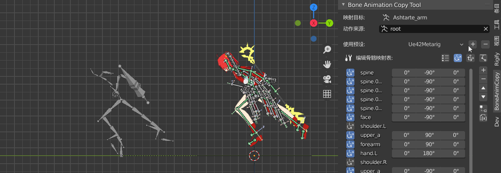
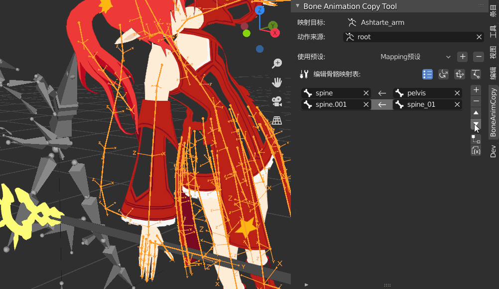

# BoneAnimCopy Tool
## What is this？
This is a plugin for retargeting skeletal animation in blender.

The inspiration for this comes from the tutorial series 
[Unlocking FBX Action Fusion](https://space.bilibili.com/260963472) 
produced by the B station uploader
[Luban Zhiliao](https://www.bilibili.com/video/BV1GE411i7j3).
The idea of mapping actions through bone constraints is very simple and versatile.

Based on this, I have further researched the solution to the problem of bone axial difference, and integrated it into this addon to simplify the related setup operation. I hope this idea can be further developed, so that more independent animators/game makers who suffer from the tediousness of motion creation can be facilitated.

## Description
### Basic Functions
#### Rotation Mapping
After installing and registering the addon, you can see the panel on the right side of the 3D view. It does not provide any functionality when the skeleton object is not selected.

Import a character model, and a skeleton with actions, that you want to map to the character. I'm using the UE4 skeleton for the running action.

Tap on the character's skeleton and the right panel will start displaying the features. The **mapped skeleton** must be the selected skeleton itself, and the **constraint target** can be any other skeleton in the scene.

After setting the running action skeleton you just imported as a **constraint target**, the full addon panel expands. The **Bone Mapping Table** at the bottom is the heart of the plugin, used to edit the bone correspondence between the target and the source in order to map the bone transformations.

The first four buttons arranged vertically on the right side are the basic add, delete, move up and down functions of a Blender list interface. First click [+] to create a new mapping. The root bones of the two models are the first vertebrae to establish the correspondence. You can see the target bone with the same source bone pointing upward diagonally.

In addition to adding a blank mapping, you can also select one or more bones in pose mode, and then click [+] to batch generate and auto-fill the targets.

#### Rotation Correction
Now we find that the character's orientation and running pose do not match after mapping the action. This is due to the different axes of the character's skeleton and the UE4 skeleton.

 
Again, the y-axis is facing up, the z-axis of the blender skeleton is facing forward, and the z-axis of the UE4 skeleton is facing left.

There are also four horizontally aligned buttons above the bone mapping table, the first of which was selected by default when editing the mapping relationship earlier. Now we click on the second button to enter the rotational modification editing mode. We can activate the rotational modification of the corresponding bone by the buttons on the left side of each row of the mapping table, and set the angle of the offset.
Blender's bones all extend on the y-axis, so in most cases you only need to correct the y-rotation.

Once you have mapped all the bones you need, you can have the character roughly mimic the movement of the other skeleton!

#### Position Mapping
The previous steps only copied the rotation information, so the running can only be done in the same place. To copy the displacement as well, you need to click on the third button to enter the editing mode of the position mapping. Again click on the button on the left to activate it on a specific bone.

#### IK Fix
If you rely on rotation alone to map movements, the final position of the hands and feet will be affected by the length of the joints, as you can see in the previous image the character's feet are not exactly on the ground. If you want to fix this, you can click the fourth button to go to IK.

However, it should be noted that the height difference of the skeleton may have an impact on the effect of the IK correction on the hand, and it is not always better with the application of IK, which will take some practice.

#### Save Preset
After you have set up the correspondence and adjusted the angle, you can save the preset, and then when you map two skeletons of the same type, you can solve the problem with one click. The operation is obvious, so I won't go into details.

Besides adding, deleting, and selecting presets in the interface, you can also click on the folder button on the right side to open a preset folder, and then save the preset file or pack it up for sharing.

### Extras
The basic working methods of the plugin are the above four, and after practicing it once, you will find that most of the workload is still on setting up the correspondence of bones. So in addition to the pairwise relationship, the plugin is also looking for some operations to improve the efficiency of the mapping.

#### Sub-level Mapping
In many cases, when a pair of bones is mapped, their respective children need to be mapped as well. Based on this pattern I've made a function to quickly relate child levels by parent level.

After selecting a valid mapping in the list, click [Child Mapping] and it will automatically determine the child level. If the source and target bones each have only one child level, it will directly generate a mapping between the child levels. For a series of spines, it can conveniently create a whole mapping.

If the source and target bones do not have only one sub-level, then a mapping will be generated for all the sub-levels of the target bone, and the rest will still need to be filled in manually.

#### Name Mapping
If the two bones that need to be mapped are named similarly, or even exactly the same, can you compare the names directly to pick the corresponding bone?

Currently, the addon uses the difflib library to analyze the similarity of the strings, and in some cases it can find the bone you want to map. However, there are many different names for bones, so the mapping results can only be used as a reference.

#### Mirror Mapping
If there is a mirror bone for both the selected bone and the target bone, you can create a new mapping by mirroring it. Blender has its own way to determine the mirror bone by its name, and the addon calls that interface. As long as the naming convention is not too weird (don't tell me you're naming mirror bones with Chinese characters for left and right...), you can basically find the mirror bone pairs correctly to create mapping.

#### Animation Baking
The addonn adds a layer of encapsulation on top of the animation baking that comes with Blender, and sets the properties so that you can bake an animation according to the appropriate frame range and set up pseudo-users with one click.

## How it works
Retargeting is implemented by adding constraints to the bones. If you turn on the Rotation Correction, Position Copy, and IK options for a mapped bone in the addon, you can see that four constraints have been added to the bone, all of which are named after the addon's acronym BAC!

**ROT_COPY** is a copy-rotation constraint, which is used for the most basic rotation mapping, so that the rotation state of the own bone becomes consistent with the target bone in world space.

**ROT_ROLL** is a transformation constraint. Transformation constraints can be used to achieve complex effects such as [Object Transformation Driving Object Transformation], but here we just adjust the value of the minimum rotation value in its [Mapped To] column, and use it as a simple constraint that produces a constant rotation effect. Applying this constraint after copying the rotation produces a constant angular offset between the target bone and its own bone, which satisfies the need for mapping when the two are initially facing different directions.

**LOC_COPY** is a copy position constraint and\n
**IK** is a simple two-section IK constraint. The effects of these two are a bit more straightforward. Once you understand the effects of these constraints, you can go beyond the limitations of the plugin's functionality and modify the constraints on your own!
